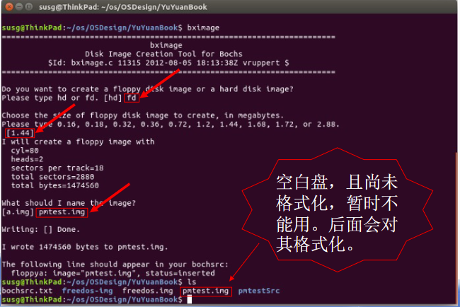
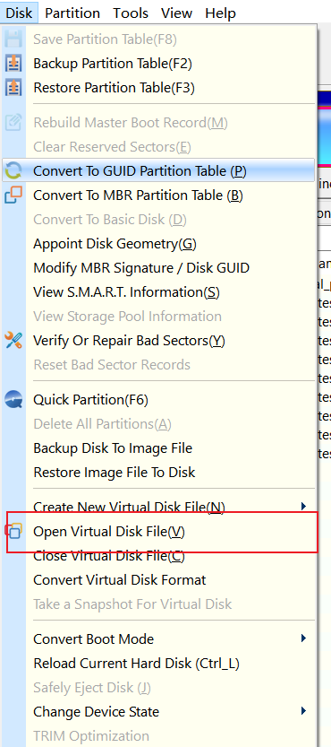
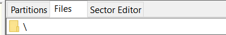

# OSProject
华中科技大学 网络空间安全学院 操作系统课程设计

## 一、环境配置

### 安装NASM、bochs

```bash
sudo apt install nasm
sudo apt install bochs vgabios bochs-x bximage
```

### 下载freedos镜像

```bash
wget https://bochs.sourceforge.io/guestos/freedos-img.tar.gz
tar -zxvf freedos-img.tar.gz
```

仅保留a.img 并改名freedos.img备用，

软盘A：启动盘、系统盘

### 制作存储测试程序的空白软盘映像文件

软盘B：pmtest.img



### 配置bochs的运行控制文件bochsrc.txt

```txt
# 文件名：bochsrc.txt
# 指定虚拟机的内存大小
megs:32
# BIOS ROM映像文件名
romimage: file=/usr/share/bochs/BIOS-bochs-latest
# VGA ROM映像文件名
vgaromimage: file=/usr/share/bochs/VGABIOS-lgpl-latest
# 指定软盘的映像文件和状态（是否已经插入）
floppya: 1_44=freedos.img, status=inserted
floppyb: 1_44=pmtest.img,  status=inserted
# 指定启动设备
boot:a
# 禁用鼠标
mouse:enabled=0
```

windows 下的配置文件

```txt
megs: 32
romimage: file="C:\\Program Files\\Bochs-2.7\\BIOS-bochs-latest"
vgaromimage: file="C:\\Program Files\\Bochs-2.7\\VGABIOS-lgpl-latest"
floppya: 1_44=freedos.img, status=inserted
floppyb: 1_44=pmtest.img, status=inserted
boot: a
mouse: enabled=0
```

### 格式化pmtest.img

`format.exe B:`

### 挂载

windows下使用DiskGenius进行挂载



在Files进行修改



## 二、实验部分

